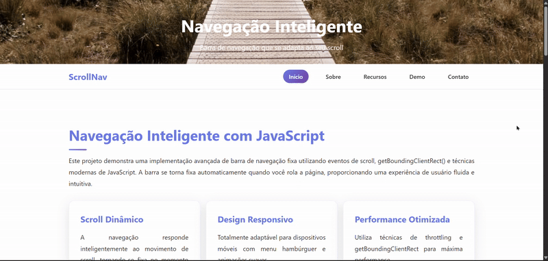

# Barra de Navegação

Este projeto é uma implementação simples de uma **barra de navegação responsiva**, desenvolvida com **HTML, CSS e JavaScript**.  
O objetivo é praticar conceitos de **frontend**, como estilização, responsividade e manipulação de elementos via JavaScript.

## 📌 Funcionalidades

- Navegação simples entre seções da página  
- Efeito de destaque no item ativo  
- Menu responsivo que se adapta a diferentes tamanhos de tela  
- Animação de abertura/fechamento do menu em dispositivos móveis  

## 🛠️ Tecnologias Utilizadas

- **HTML5** – estrutura da página  
- **CSS3** – estilização e responsividade  
- **JavaScript (ES6)** – interatividade (abrir/fechar menu e efeitos de navegação)  

## 📂 Estrutura do Projeto

```
📦 BarraNavegacao
├── index.html      # Estrutura da página
├── style.css       # Estilos da barra de navegação
├── script.js       # Funcionalidades da navegação
└── hero-bcg.jpeg   # Imagem de fundo
```

## 🚀 Como executar

1. Clone este repositório:

   ```
   git clone https://github.com/PedroHenriqueDuart3/BarraNavegacao.git
   ```
2. Abra o arquivo index.html em qualquer navegador.

   Não é necessário instalar dependências, pois o projeto usa apenas HTML, CSS e JavaScript puro.

## 📸 Demonstração


## 📖 Aprendizados

- Como estruturar uma barra de navegação

- Técnicas de CSS para responsividade

- Manipulação do DOM com JavaScript
